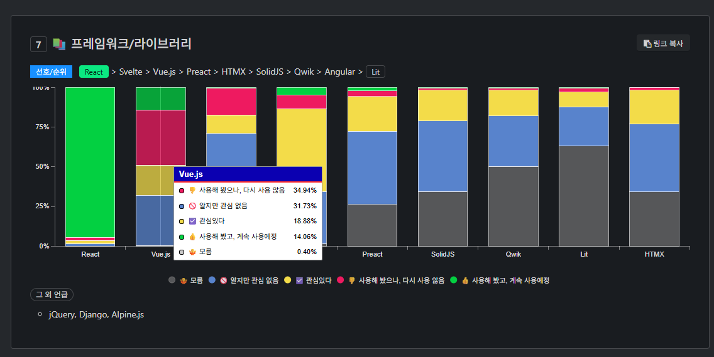
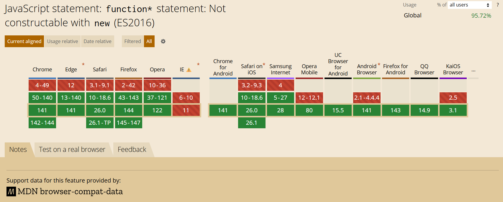
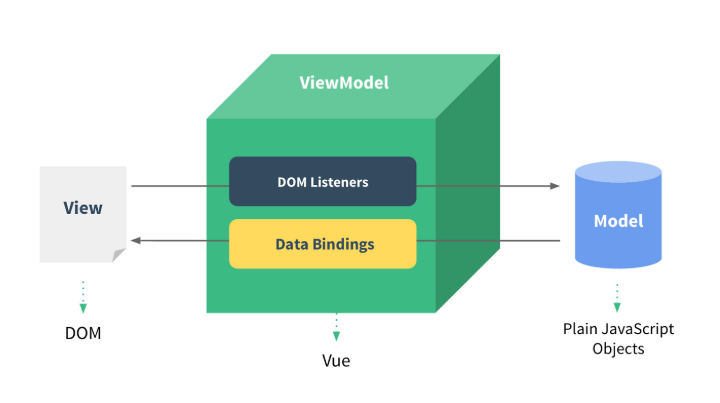

# Vue.js

## 소개

Vue는 사용자 인터페이스를 구축하기 위한 자바스크립트 프레임워크입니다.<br>
표준 HTML, CSS, JavaScript 위에 구축되며, 선언적이고 컴포넌트 기반의 프로그래밍 모델을 제공합니다.

### 탄생 배경

Vue는 프랑스어로 "view"를 뜻하며, Evan You가 Google에서 AngularJS를 사용하다가 그 단점을 개선하고자 2014년에 개발했습니다.

**주요 개선 사항**
- AngularJS의 복잡성을 줄이고 더 가볍고 유연한 프레임워크 제공
- 학습 곡선을 낮추고 접근성 향상
- 성능 최적화와 더 나은 개발자 경험 제공

### 설계 철학

Vue는 **MVVM(Model-View-ViewModel) 패턴**을 기반으로 디자인되었으며,<br>
재사용 가능한 UI를 컴포넌트로 묶어 사용할 수 있습니다.

**핵심 특징**
- **점진적 프레임워크** - 필요한 기능만 선택적으로 사용 가능
- **반응형 데이터 바인딩** - 데이터 변경 시 자동으로 UI 업데이트
- **컴포넌트 기반 아키텍처** - 재사용 가능한 독립적인 UI 단위
- **가상 DOM** - 효율적인 렌더링 성능

::: details 프레임워크 트렌드
웹 애플리케이션 개발 시 프론트엔드에 주로 사용되는 프레임워크는 React.js, Vue.js, Angular 등이 있습니다.

[네이버 오픈 소스](https://naver.github.io/fe-news/stateof-fejs/2025/)의 2025년 FE 프레임워크/라이브러리 선호도 집계 결과, Vue.js는 2위를 차지했습니다.



**Vue.js를 사용하는 주요 기업**
- GitLab (전체 프론트엔드)
- Adobe (일부 제품)
- 샤오미 (Xiaomi)
- 알리바바 (Alibaba)
:::

---

## 호환성

Vue 3는 IE11을 제외한 ES2015(ES6)를 지원하는 모든 브라우저를 지원합니다.



**지원 브라우저**
- Chrome (최신 버전)
- Firefox (최신 버전)
- Safari (최신 버전)
- Edge (최신 버전)

::: info 참고
IE11 지원이 필요한 경우 Vue 2를 사용해야 합니다.
:::

---

## MVVM 패턴

MVVM은 **Model-View-ViewModel**의 줄임말로,<br>
UI와 데이터 제어 로직을 분리하기 위해 설계된 디자인 패턴입니다.

### MVVM의 필요성

전통적인 방식에서는 직접 DOM을 조작하고 데이터를 동기화해야 했습니다.
```javascript
// 전통적인 방식 - 수동 DOM 조작
const button = document.getElementById('button')
let count = 0

button.addEventListener('click', () => {
  count++
  document.getElementById('count').textContent = count
})
```

MVVM 패턴에서는 ViewModel이 이러한 작업을 자동으로 처리합니다.

### MVVM 구조



#### View (뷰)

사용자에게 보여지는 화면으로, 사용자 입력을 받고 데이터를 시각적으로 표현합니다.<br>
Vue에서는 HTML DOM과 템플릿을 의미합니다.
```vue
<template>
  <!-- View 영역 -->
  <div>
    <p>{{ message }}</p>
    <button @click="updateMessage">변경</button>
  </div>
</template>
```

#### Model (모델)

데이터를 담는 용기로, 비즈니스 로직과 데이터 구조를 정의합니다.<br>
보통 서버에서 가져온 데이터를 저장하며, Vue에서는 JavaScript 객체와 상태(state)를 의미합니다.
```javascript
// Model 영역
const user = {
  name: 'John',
  age: 30,
  email: 'john@example.com'
}
```

#### ViewModel (뷰 모델)

View와 Model을 연결하는 중간 계층으로, 다음 기능을 담당합니다.

- **DOM Listener** - View의 이벤트를 감지하여 Model 업데이트
- **Data Binding** - Model의 변경을 감지하여 View 업데이트

Vue에서는 Vue 인스턴스가 ViewModel 역할을 합니다.
```javascript
// ViewModel 영역
import { ref } from 'vue'

const message = ref('Hello')  // Model
const updateMessage = () => {  // DOM Listener
  message.value = 'World'      // Data Binding으로 자동 View 업데이트
}
```

### MVVM의 장점

**관심사의 분리**
- View, Model, ViewModel 각각의 역할에만 집중

**양방향 데이터 바인딩**
- 뷰에서 값이 바뀌면 데이터에 자동 반영
- 데이터가 바뀌면 뷰에도 자동 반영

**테스트 용이성**
- View와 로직이 분리되어 단위 테스트가 쉬움
- ViewModel을 독립적으로 테스트 가능

---

## 싱글 파일 컴포넌트 (SFC)

Vue 프로젝트에서는 **싱글 파일 컴포넌트**(.vue 파일)를 사용하여 컴포넌트를 작성합니다.

### SFC의 구조

Vue SFC는 컴포넌트의 로직(JavaScript), 템플릿(HTML), 스타일(CSS)을 하나의 파일에 캡슐화합니다.
```vue
<!-- 1. 로직 (JavaScript) -->
<script setup>
import { ref } from 'vue'

const username = ref('John')

const greet = () => {
  alert(`안녕하세요, ${username.value}님!`)
}
</script>

<!-- 2. 템플릿 (HTML) -->
<template>
  <div class="user-profile">
    <h2>{{ username }}</h2>
    <button @click="greet">인사하기</button>
  </div>
</template>

<!-- 3. 스타일 (CSS) -->
<style scoped>
.user-profile {
  padding: 20px;
  border: 1px solid #ddd;
}
</style>
```

---

## API 스타일

Vue 컴포넌트는 **옵션 API**와 **컴포지션 API**라는 두 가지 API 스타일로 작성할 수 있습니다.

### 컴포지션 API (Composition API)

Vue 3에서는 일반적으로 컴포지션 API를 사용합니다.<br>
가져온 API 함수들을 사용하여 컴포넌트 로직을 정의합니다.

#### `<script setup>` 사용

`<script setup>`은 Vue가 빌드 시점에 코드를 자동 변환하여, `setup()` 함수나 `return` 문 같은 반복적인 코드 없이 
컴포지션 API를 간편하게 사용할 수 있게 합니다.
```vue
<script setup>
import { ref } from 'vue'

// 반응형 상태
const count = ref(0)

// 메서드
const increment = () => {
  count.value++
}

// 모든 변수/함수가 자동으로 템플릿에 노출됨
</script>

<template>
  <div>
    <p>Count: {{ count }}</p>
    <button @click="increment">증가</button>
  </div>
</template>

<style scoped>
button {
  font-weight: bold;
}
</style>
```

#### `setup()` 함수 사용

`<script setup>`을 사용하지 않는 경우, `setup()` 함수를 명시적으로 선언하고 템플릿에서 사용할 것들을 반환해야 합니다.
```vue
<script>
import { ref } from 'vue'

export default {
  // setup()은 Composition API를 위한 특별한 훅
  setup() {
    const count = ref(0)
    
    const increment = () => {
      count.value++
    }

    // 템플릿에서 사용할 것들을 명시적으로 반환
    return {
      count,
      increment
    }
  }
}
</script>

<template>
  <div>
    <p>Count: {{ count }}</p>
    <button @click="increment">증가</button>
  </div>
</template>
```

### 컴포지션 API의 장점

**로직 재사용성**
- 관련된 로직을 함수로 추출하여 재사용 가능

**더 나은 타입 추론**
- TypeScript와 함께 사용 시 자동 완성과 타입 체크가 더 잘 동작

**유연한 코드 조직**
- 기능별로 코드를 그룹화 가능

::: details 옵션 API (Options API)

옵션 API는 Vue 2에서 주로 사용되던 스타일입니다.<br>
현재도 지원되지만, 새 프로젝트에서는 컴포지션 API 사용을 권장합니다.

### 옵션 API 구조

옵션 API에서는 `data`, `methods`, `computed`, `mounted` 같은 옵션 객체를 사용하여 컴포넌트 로직을 정의합니다. 옵션으로 정의된 속성들은 `this`로 접근할 수 있습니다.
```vue
<script>
export default {
  // 반응형 데이터
  data() {
    return {
      count: 0,
      message: 'Hello'
    }
  },

  // 계산된 속성
  computed: {
    doubled() {
      return this.count * 2
    }
  },

  // 메서드
  methods: {
    increment() {
      this.count++
    }
  },

  // 라이프사이클 훅
  mounted() {
    console.log(`The initial count is ${this.count}.`)
  }
}
</script>

<template>
  <div>
    <p>Count: {{ count }}</p>
    <p>Doubled: {{ doubled }}</p>
    <button @click="increment">증가</button>
  </div>
</template>
```
:::