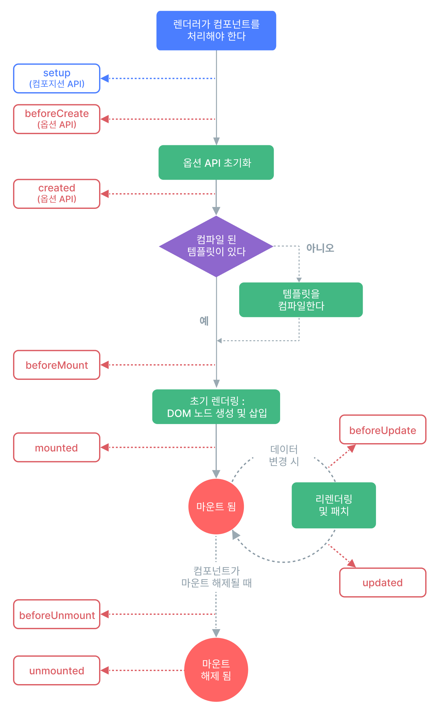

# 생명주기 훅

Vue 컴포넌트는 생성부터 소멸까지 단계를 거치며, 이를 **컴포넌트의 생명주기**(Lifecycle)라고 합니다.<br>
Vue는 각 단계에서 특정 코드를 실행할 수 있도록 **생명주기 훅**(Lifecycle Hooks)을 제공합니다.

## 생명주기 다이어그램

Vue 컴포넌트의 생명주기는 크게 생성(Creation), 장착(Mounting), 업데이트(Updating), 소멸(Unmounting)의 네 단계로 나뉩니다.



## 주요 생명주기 훅

| 훅 | 설명 |
| --- | --- |
| `onBeforeMount()` | 컴포넌트가 DOM에 마운트되기 직전에 호출됩니다. |
| `onMounted()` | 컴포넌트가 DOM에 마운트된 후에 호출됩니다. |
| `onBeforeUpdate()` | 컴포넌트의 반응형 상태가 변경되어 DOM 트리가 업데이트되기 직전에 호출됩니다. |
| `onUpdated()` | 컴포넌트의 반응형 상태가 변경되어 DOM 트리가 업데이트된 후에 호출됩니다. |
| `onBeforeUnmount()` | 컴포넌트가 언마운트되기 직전에 호출됩니다. |
| `onUnmounted()` | 컴포넌트가 언마운트된 후에 호출됩니다. |
| `onActivated()` | `<KeepAlive>` 컴포넌트가 활성화될 때 호출됩니다. |
| `onDeactivated()` | `<KeepAlive>` 컴포넌트가 비활성화될 때 호출됩니다. |

::: details 더보기
**마운트된 경우**
- 컴포넌트가 화면에 등장한 경우이며, HTML DOM 위에 실제로 그려져서
사용자에게 보여지고 이벤트도 작동 및 반응형 데이터도 연결된 상태를 말합니다.

**언마운트된 경우**
- 컴포넌트가 화면에서 퇴장된 경우이며, DOM에서 제거되고 연결되었던 모든 반응형 기능도 끊어진 상태를 말합니다.

**KeepAlive**
- `<KeepAlive>`는 여러 컴포넌트 간을 동적으로 전환할 때 컴포넌트 인스턴스를 조건부로 캐시할 수 있게 해주는 내장 컴포넌트입니다.
:::

## 코드 예제

```vue
<script setup>
import { ref, onMounted, onUpdated, onUnmounted } from 'vue'

const count = ref(0)

onMounted(() => {
  console.log('컴포넌트가 마운트되었습니다.');
})

onUpdated(() => {
  console.log('컴포넌트가 업데이트되었습니다.');
})

onUnmounted(() => {
  console.log('컴포넌트가 언마운트됩니다.');
})
</script>

<template>
  <button @click="count++">Count is: {{ count }}</button>
</template>
```

::: tip 언제 사용해야할까?
라이프사이클 훅은 컴포넌트가 생성되고, 화면에 나타나고, 사라지는 각각의 순간에 맞춰 필요한 작업(데이터 로딩, 이벤트 등록, 정리 등)을 수행하기 위해 사용할 수 있습니다. :)
:::