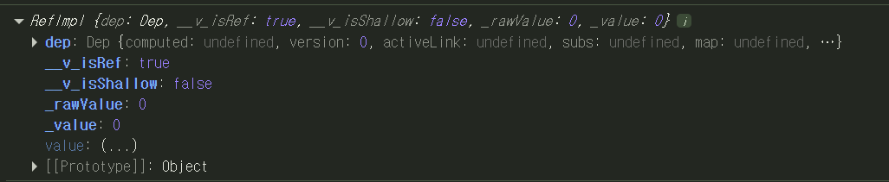
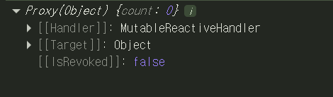

# 반응형 데이터와 반응성 시스템

## 반응형 데이터

Composition API에서는 `ref()`와 `reactive()` 함수를 사용하여 반응형 상태를 선언합니다.

### ref()

`ref()`는 인자를 받아 `.value` 속성이 있는 ref 객체로 감싸 반환합니다.

**주요 특징:**
- 원시 타입(string, number, boolean)과 객체 타입 모두 사용 가능합니다.
- ref는 원시적인 값을 담을 수 있으며, 자신의 값을 깊게 반응형으로 만듭니다.
- `.value`를 통해 값에 접근하고 수정할 수 있습니다.
- 템플릿에서는 `.value`가 자동으로 언래핑되어 사용됩니다.

```javascript
import { ref } from 'vue'

const count = ref(0)

console.log(count)        // { value: 0 }
console.log(count.value)  // 0

count.value++
console.log(count.value)  // 1
```

**템플릿에서의 사용:**
```vue
<template>
  <!-- 템플릿에서는 .value 없이 사용 -->
  <p>{{ count }}</p>
  <button @click="count++">증가</button>
</template>

<script setup>
import { ref } from 'vue'
const count = ref(0)
</script>
```

ref로 만든 객체는 아래와 같이 구성됩니다.


---

### Vue의 반응성 시스템

템플릿에서 ref를 사용하고, 이후 ref의 값을 변경하면 Vue는 변경을 자동으로 감지하고 DOM을 업데이트합니다. 이는 **의존성 추적 기반의 반응성 시스템** 덕분입니다.

**동작 과정:**
1. 컴포넌트가 처음 렌더링될 때, Vue는 렌더링에 사용된 모든 ref를 추적합니다.
2. 이후 ref가 변경되면, 이를 추적 중인 컴포넌트에 재렌더링을 트리거합니다.

**왜 .value가 필요한가?**

일반 JavaScript에서는 단순 변수의 접근이나 변경을 감지할 방법이 없습니다:

```javascript
// 순수 JavaScript - 변경 감지 불가능
let count = 0
count++  // JavaScript는 이 변경을 알 수 없음
```

하지만 객체의 속성에 대해서는 getter와 setter를 사용해 get/set 연산을 가로챌 수 있습니다:

```javascript
const obj = {
  _count: 0,
  get count() {
    console.log('읽기 감지!')
    return this._count
  },
  set count(value) {
    console.log('변경 감지!')
    this._count = value
  }
}
```

**ref의 핵심 아이디어:**

`.value` 속성은 Vue가 ref에 접근하거나 변경될 때 이를 감지할 기회를 제공합니다.
내부적으로 Vue는:
- **getter에서 추적(tracking)을** 수행 → "누가 이 값을 사용하는가?"
- **setter에서 트리거(triggering)를** 수행 → "이 값을 사용하는 모든 곳을 업데이트"

**ref의 또 다른 장점:**

단순 변수와 달리 ref를 함수에 전달해도 최신 값과 반응성 연결을 유지할 수 있습니다:

```javascript
// ❌ 일반 변수 - 반응성 상실
let count = 0
function increment(n) {
  n++  // 원본 count에 영향 없음
}
increment(count)

// ✅ ref - 반응성 유지
const count = ref(0)
function increment(countRef) {
  countRef.value++  // 원본에 영향을 줌
}
increment(count)
```

---

### reactive()

ref가 내부 값을 특별한 객체로 감싸는 것과 달리, `reactive()`는 객체 자체를 반응형으로 만듭니다.

**주요 특징:**
- 객체 타입에만 동작합니다 (원시 타입은 사용할 수 없습니다)
- 반응형 객체는 JavaScript Proxy이며, 일반 객체처럼 동작합니다
- `.value` 없이 직접 속성에 접근할 수 있습니다
- Vue가 반응성 추적 및 트리거를 위해 반응형 객체의 모든 속성 접근과 변경을 가로챌 수 있습니다
- reactive()가 반환하는 값은 원본 객체의 Proxy이며, 원본 객체와 같지 않습니다

```javascript
import { reactive } from 'vue'

const state = reactive({ count: 0 })

console.log(state.count)  // 0
state.count++            // .value 불필요
console.log(state.count)  // 1
```

reactive로 만든 객체는 아래와 같이 구성됩니다.
ref와 다르게 다른 속성이 없으며 reactive로 반응성을 얻기 위해 Proxy와 Reflect를 사용합니다.


---

### reactive()의 한계

#### 1. 제한된 값 타입
객체 타입(객체, 배열, Map, Set)에만 동작하여 원시 타입은 사용할 수 없습니다.

```javascript
// ❌ 원시 타입 불가
const count = reactive(0)

// ✅ 객체만 가능
const state = reactive({ count: 0 })
```

#### 2. 전체 객체 교체 불가
Vue의 반응성 추적은 속성 접근을 기반으로 하여 항상 같은 반응형 객체 참조를 유지해야 합니다. 반응형 객체 자체를 교체하게 되면 참조와의 반응성 연결이 끊깁니다.

```javascript
let state = reactive({ count: 0 })

// ❌ 반응성 연결 끊김
state = reactive({ count: 1 })

// ✅ 속성 변경은 가능
state.count = 1
```

#### 3. 구조 분해에 불리함
반응형 객체의 원시 타입 속성을 로컬 변수로 구조 분해하거나, 해당 속성을 함수에 전달하면 반응성 연결이 끊깁니다.

```javascript
const state = reactive({ count: 0, name: 'John' })

// ❌ 반응성 상실
let { count, name } = state
count++  // state.count는 변경되지 않음

// ❌ 함수 전달 시에도 문제
function increment(n) {
  n++  // 원본 state에 영향 없음
}
increment(state.count)

// ✅ 해결: toRefs() 사용
import { toRefs } from 'vue'
const { count, name } = toRefs(state)
count.value++  // 이제 반응형!
```
::: tip
이러한 한계로 인해, 반응형 상태를 선언할 때는 `ref()`를 기본 API로 사용하는 것을 권장합니다.
:::

## Vue에서의 반응성 동작 방식

**순수 JavaScript의 한계:**
```javascript
let count = 0
count++  // JavaScript는 이 변경을 감지할 수 없음

// 수동으로 UI 업데이트 필요
function updateUI() {
  document.getElementById('count').textContent = count
}

updateUI()  // 매번 수동 호출!
```

**Vue의 자동 반응성:**
```vue
<template>
  <p>{{ count }}</p>
  <button @click="count++">증가</button>
</template>

<script setup>
import { ref } from 'vue'
const count = ref(0)
// count 변경 시 자동으로 DOM 업데이트!
</script>
```

---

### 반응성 구현 원리

JavaScript에서 속성 접근을 가로채는 방법은 두 가지가 있습니다: **getter/setter**와 **Proxy**입니다.
Proxy를 반응형 객체(`reactive`)에 사용하고, getter/setter를 `ref`에 사용합니다.

#### Getter/Setter 예제

```javascript
const obj = {
  _count: 0,
  get count() {
    console.log('읽기 감지!')
    return this._count
  },
  set count(value) {
    console.log('변경 감지!')
    this._count = value
    updateUI()  // 변경 시 UI 업데이트
  }
}

console.log(obj.count)  // "읽기 감지!" → 0
obj.count = 5           // "변경 감지!" → UI 업데이트
```

#### Proxy 예제

```javascript
const target = { count: 0 }

const proxy = new Proxy(target, {
  get(target, key) {
    console.log(`${key} 읽기 감지!`)
    return target[key]
  },
  set(target, key, value) {
    console.log(`${key} 변경 감지!`)
    target[key] = value
    updateUI()
    return true
  }
})

console.log(proxy.count)  // "count 읽기 감지!" → 0
proxy.count = 5           // "count 변경 감지!" → UI 업데이트
```

---

### Vue 내부 동작

아래는 Vue 3에서 `reactive()`와 `ref()`가 어떻게 동작하는지 보여주는 의사 코드입니다:

```javascript
// reactive() 구현
function reactive(obj) {
  return new Proxy(obj, {
    get(target, key) {
      track(target, key)     // 의존성 추적
      return target[key]
    },
    set(target, key, value) {
      target[key] = value
      trigger(target, key)   // 업데이트 트리거
      return true
    }
  })
}

// ref() 구현
function ref(value) {
  const refObject = {
    get value() {
      track(refObject, 'value')  // 의존성 추적
      return value
    },
    set value(newValue) {
      value = newValue
      trigger(refObject, 'value')  // 업데이트 트리거
    }
  }
  return refObject
}
```

#### Track (추적) - 속성을 읽을 때

`track()` 내부에서는 현재 실행 중인 이펙트가 있는지 확인합니다. 있다면, 추적 중인 속성에 대한 구독자 이펙트를 찾아서 그 이펙트를 집합(Set)에 추가합니다.

```javascript
let activeEffect  // 현재 실행 중인 이펙트 (컴포넌트, computed 등)

function track(target, key) {
  if (activeEffect) {
    const effects = getSubscribersForProperty(target, key)
    effects.add(activeEffect)  // 구독자 등록
  }
}
```

**저장 구조:**

이펙트 구독은 전역 `WeakMap<target, Map<key, Set<effect>>>` 데이터 구조에 저장됩니다.
- 속성에 대한 구독 이펙트 집합이 없다면 (처음 추적되는 경우), 새로 생성합니다.
- 이것이 `getSubscribersForProperty()` 함수가 하는 일입니다.

```javascript
// 전역 저장소
const targetMap = new WeakMap()

function getSubscribersForProperty(target, key) {
  // 1. target에 대한 Map 가져오기 (없으면 생성)
  let depsMap = targetMap.get(target)
  if (!depsMap) {
    targetMap.set(target, (depsMap = new Map()))
  }
  
  // 2. key에 대한 Set 가져오기 (없으면 생성)
  let dep = depsMap.get(key)
  if (!dep) {
    depsMap.set(key, (dep = new Set()))
  }
  
  return dep
}
```

#### Trigger (트리거) - 속성을 변경할 때

`trigger()` 내부에서는 다시 한 번 해당 속성의 구독자 이펙트를 찾습니다.
그리고 모든 구독자를 실행시킵니다.

```javascript
function trigger(target, key) {
  const effects = getSubscribersForProperty(target, key)
  effects.forEach((effect) => effect())  // 모든 구독자 실행
}
```

---

### 실제 동작 흐름 예제

```vue
<script setup>
import { ref, computed } from 'vue'

const count = ref(0)
const doubled = computed(() => count.value * 2)

// === 내부 동작 과정 ===

// 1. 컴포넌트 렌더링 시작
//    - activeEffect = 렌더 함수

// 2. count.value 읽기 (템플릿에서)
//    - count의 getter 실행
//    - track(count, 'value') 호출
//    - 렌더 함수를 count의 구독자로 등록

// 3. doubled 계산 시 count.value 읽기
//    - activeEffect = computed의 이펙트
//    - track(count, 'value') 호출
//    - computed도 count의 구독자로 등록

// === count 변경 시 ===
count.value++

// 1. count의 setter 실행
// 2. trigger(count, 'value') 호출
// 3. 등록된 구독자들 실행:
//    - computed(doubled) 재계산
//    - 컴포넌트 렌더 함수 재실행
// 4. DOM 자동 업데이트
</script>

<template>
  <p>Count: {{ count }}</p>
  <p>Double: {{ doubled }}</p>
</template>
```