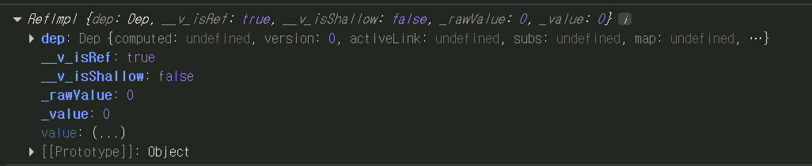
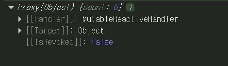

# ref와 reactive: Vue 반응성 시스템

Composition API에서는 `ref()`와 `reactive()` 함수를 사용하여 반응형 상태를 선언합니다.

---

## `ref()`

`ref()`는 인자를 받아 `.value` 속성이 있는 ref 객체로 감싸 반환합니다.

### 주요 특징

- **타입 지원**: 원시 타입(string, number, boolean)과 객체 타입 모두 사용 가능
- **깊은 반응성**: 원시적인 값을 담을 수 있으며, 자신의 값을 깊게 반응형으로 만듦
- **접근 방식**: `.value`를 통해 값에 접근하고 수정
- **템플릿 자동 언래핑**: 템플릿에서는 `.value`가 자동으로 언래핑되어 사용

### 기본 사용법

```javascript
import { ref } from 'vue'

const count = ref(0)

console.log(count)        // { value: 0 }
console.log(count.value)  // 0

count.value++
console.log(count.value)  // 1
```

### 템플릿에서 사용

```vue
<template>
  <!-- 템플릿에서는 .value 없이 사용 -->
  <p>{{ count }}</p>
  <button @click="count++">증가</button>
</template>

<script setup>
import { ref } from 'vue'
const count = ref(0)
</script>
```

ref로 만든 객체는 다음과 같이 반환됩니다.




템플릿에서 `ref`를 사용하고 값을 변경하면, Vue는 변경을 자동으로 감지하고 DOM을 업데이트합니다. 

이는 **의존성 추적 기반의 반응성 시스템** 덕분입니다.

#### 동작 과정

1. **렌더링 시**: 컴포넌트가 처음 렌더링될 때, Vue는 렌더링에 사용된 모든 ref를 추적
2. **변경 감지**: ref가 변경되면, 이를 추적 중인 컴포넌트에 재렌더링을 트리거

### 왜 `.value`로 사용될까?

일반 JavaScript에서는 단순 변수(원시값)의 접근이나 변경을 감지할 방법이 없습니다.

```javascript
// 순수 JavaScript - 변경 감지 불가능
let count = 0
count++  // JavaScript는 이 변경을 알 수 없음
```

하지만 **객체의 속성**에 대해서는 getter와 setter를 사용해 접근과 변경을 가로챌 수 있습니다.

```javascript
const obj = {
  _count: 0, // 실제 값을 저장하는 내부 속성

  // 읽기가 발생할 때
  get count() {
    console.log('읽기 감지!')
    return this._count
  },

  // 쓰기가 발생할 때
  set count(value) {
    console.log('변경 감지!')
    this._count = value
    updateUI()  // 변경 시 UI 업데이트
  }
}

console.log(obj.count)  // "읽기 감지!" → 0
obj.count = 5           // "변경 감지!" → UI 업데이트
```

Vue의 `ref`는 이러한 **getter/setter의 원리**를 사용합니다.<br>
`.value` 속성은 Vue가 `ref`에 접근하거나 변경될 때 이를 감지할 기회를 제공합니다.

```js
function ref(value) {
  const refObject = {
    get value() {
      track(refObject, 'value')  // 📝 현재 컴포넌트가 이 속성을 사용 중이라고 기록
      return value
    },
    set value(newValue) {
      value = newValue
      trigger(refObject, 'value')  // 🔔 이 속성을 사용하는 모든 컴포넌트를 업데이트
    }
  }
  return refObject
}
```
Vue는 `.value`를 통해 내부적으로:
- 데이터를 읽는 경우: **getter에서 `track()` 실행**
- 데이터를 변경하는 경우: **setter에서 `trigger()` 실행**

---

## `reactive()`

`ref`가 내부 값을 특별한 객체로 감싸는 것과 달리, `reactive()`는 객체 자체를 반응형으로 만듭니다.

### 주요 특징

- **타입 제한**: 객체 타입에만 동작 (원시 타입은 사용 불가)
- **Proxy 기반**: 반응형 객체는 JavaScript Proxy이며, 일반 객체처럼 동작
- **직접 접근**: `.value` 없이 직접 속성에 접근 가능
- **자동 추적**: Vue가 반응성 추적 및 트리거를 위해 모든 속성 접근과 변경을 가로챔
- **Proxy 반환**: 반환되는 값은 원본 객체의 Proxy이며, 원본 객체와 같지 않음

### 기본 사용법

```javascript
import { reactive } from 'vue'

const state = reactive({ count: 0 })

console.log(state.count)  // 0
state.count++            // .value 불필요
console.log(state.count)  // 1
```

`reactive`로 만든 객체는 다음과 같이 반환됩니다.



`ref`와 다르게 다른 속성이 없으며, `reactive`는 반응성을 얻기 위해 **Proxy**를 사용합니다.


### 왜 Proxy를 사용할까?
객체를 만들 때, JavaScript에서는 단순히 데이터만 저장하며, 객체에는 감시 기능이 존재하지 않습니다.
Vue가 자동으로 화면을 업데이트하기 위해 데이터 변경을 알아야 하는데, 일반 객체로는 불가능합니다.
```js
const user = { name: 'John', age: 25 }

user.age = 26 // 변경을 알 수 없음
```

Proxy는 대상 객체를 감싸 기본 동작을 가로채 특별한 동작으로 가미시키는 대리인 역할을 합니다. <br>
Proxy를 사용하면 Proxy에 감싸져 있는 원본 객체를 접근하기 위해 Proxy를 무조건 거쳐야 합니다.
```js
const proxy = new Proxy(원본객체, {
  // 읽기가 발생할 때
  get(target, key) {
    console.log('읽기 감지!')
    return target[key]
  },

  // 쓰기가 발생할 때
  set(target, key, value) {
    console.log('변경 감지!')
    target[key] = value
    return true
  }
})
```

이렇게 Proxy는 모든 동작을 중간에서 가로채서 우리가 원하는 일을 하게 해주는데,<br>
Vue는 Proxy의 기능을 사용하여 **get**과 **set**을 사용합니다.
``` js
function reactive(obj) {
  return new Proxy(obj, {
    get(target, key) {
      track(target, key) // 📝 현재 컴포넌트가 이 속성을 사용 중이라고 기록
      return target[key]
    },
    
    set(target, key, value) {
      target[key] = value
      trigger(target, key) // 🔔 이 속성을 사용하는 모든 컴포넌트를 업데이트
      return true
    }
  })
}
```


### `reactive()`의 한계

#### 1️⃣ 제한된 값 타입

객체 타입(객체, 배열, Map, Set)에만 동작하며 원시 타입은 사용할 수 없습니다.

```javascript
// ❌ 원시 타입 불가
const count = reactive(0)

// ✅ 객체만 가능
const state = reactive({ count: 0 })
```

#### 2️⃣ 전체 객체 교체 불가

Vue의 반응성 추적은 속성 접근을 기반으로 하므로 항상 같은 반응형 객체 참조를 유지해야 합니다. 

반응형 객체 자체를 교체하면 참조와의 반응성 연결이 끊깁니다.

```javascript
let state = reactive({ count: 0 })

// ❌ 반응성 연결 끊김
state = reactive({ count: 1 })

// ✅ 속성 변경은 가능
state.count = 1
```

#### 3️⃣ 구조 분해에 불리함

반응형 객체의 원시 타입 속성을 로컬 변수로 구조 분해하거나 함수에 전달하면 반응성 연결이 끊깁니다.

```javascript
const state = reactive({ count: 0, name: 'John' })

// ❌ 반응성 상실
let { count, name } = state
count++  // state.count는 변경되지 않음

// ❌ 함수 전달 시에도 문제
function increment(n) {
  n++  // 원본 state에 영향 없음
}
increment(state.count)

// ✅ 해결: toRefs() 사용
import { toRefs } from 'vue'
const { count, name } = toRefs(state)
count.value++  // 이제 반응형!
```

> **💡 권장 사항**  
> 이러한 한계로 인해 반응형 상태를 선언할 때는 `ref()`를 기본 API로 사용하는 것을 권장합니다.

---

## Vue의 반응성 동작 방식

### 순수 JavaScript의 한계

```javascript
let count = 0
count++  // JavaScript는 이 변경을 감지할 수 없음

// 수동으로 UI 업데이트 필요
function updateUI() {
  document.getElementById('count').textContent = count
}

updateUI()  // 매번 수동 호출!
```

### Vue의 자동 반응성

```vue
<template>
  <p>{{ count }}</p>
  <button @click="count++">증가</button>
</template>

<script setup>
import { ref } from 'vue'
const count = ref(0)
// count 변경 시 자동으로 DOM 업데이트!
</script>
```

### Vue 내부 동작

JavaScript에서 속성 접근을 가로채는 방법은 **getter/setter** 와 **Proxy**가 있습니다.

Vue는:

- **getter/setter**를 `ref`에 사용
- **Proxy**를 반응형 객체(`reactive`)에 사용

아래는 Vue 3에서 `ref()`와 `reactive()`가 어떻게 동작하는지 보여주는 의사 코드입니다.


### `ref()` 구현

```javascript
function ref(value) {
  const refObject = {
    get value() {
      track(refObject, 'value')  // 의존성 추적
      return value
    },
    set value(newValue) {
      value = newValue
      trigger(refObject, 'value')  // 업데이트 트리거
    }
  }
  return refObject
}
```

### `reactive()` 구현

```javascript
function reactive(obj) {
  return new Proxy(obj, {
    get(target, key) {
      track(target, key)     // 의존성 추적
      return target[key]
    },
    set(target, key, value) {
      target[key] = value
      trigger(target, key)   // 업데이트 트리거
      return true
    }
  })
}
```

### Track - 속성을 읽을 때

`track()` 함수는 누가 이 데이터를 사용하고 있는지 기록하는 함수입니다.

상태 값을 읽으면 Vue는 이 컴포넌트가 값을 사용하는 중이라 기록하고,<br>
나중에 값이 변경되면 어떤 컴포넌트를 업데이트해야 하는지 알 수 있습니다.

```javascript
let activeEffect  // 현재 실행 중인 이펙트 (컴포넌트, computed 등)

function track(target, key) {
  // 1. 현재 실행 중인 이펙트가 있는지 확인
  if (activeEffect) {
    // 2. 이 속성(target.key)의 구독자 목록 가져오기
    const effects = getSubscribersForProperty(target, key)

    // 3. 현재 이펙트를 구독자로 등록
    effects.add(activeEffect)  // 구독자 등록
  }
}
```

::: details 더보기
- `getSubscribersForProperty()` 함수
: 특정 객체의 특정 속성을 사용하는 구독자 목록을 가져옵니다.

```js
// 전역 저장소
const targetMap = new WeakMap()

function getSubscribersForProperty(target, key) {
  // === 1단계: target(객체)에 대한 Map 가져오기 ===
  let depsMap = targetMap.get(target)
  
  // 처음 이 객체를 추적하는 경우 → 새 Map 생성
  if (!depsMap) {
    depsMap = new Map()
    targetMap.set(target, depsMap)
  }
  
  // === 2단계: key(속성명)에 대한 Set 가져오기 ===
  let dep = depsMap.get(key)
  
  // 처음 이 속성을 추적하는 경우 → 새 Set 생성
  if (!dep) {
    dep = new Set()
    depsMap.set(key, dep)
  }
  
  // === 3단계: 구독자 Set 반환 ===
  return dep
}
```
:::

#### 저장 구조

이펙트(`effects`) 구독은 전역 `WeakMap<target, Map<key, Set<effect>>>` 데이터 구조에 저장됩니다.

```
WeakMap {
  target1 → Map {
    key1 → Set { effect1, effect2 }
    key2 → Set { effect3 }
  }
  target2 → Map {
    key1 → Set { effect4 }
  }
}
```

```js
// 상황: 두 컴포넌트가 같은 데이터를 사용
const state1 = reactive({ count: 0, name: 'John' })
const state2 = reactive({ age: 25 })

// Component1이 state1.count 사용
// Component2도 state1.count 사용
// Component1이 state1.name 사용
// Component3이 state2.age 사용

// 저장 구조:
WeakMap {
  state1 → Map {
    'count' → Set { Component1, Component2 },
    'name'  → Set { Component1 }
  },
  state2 → Map {
    'age' → Set { Component3 }
  }
}
```

### Trigger - 속성을 변경할 때

`trigger()` 함수는 데이터가 변경되었을 때 이 데이터를 사용하는 모든 곳에 알려서 업데이트시키는 함수입니다.

```javascript
function trigger(target, key) {
  // 1. 이 속성(target.key)을 사용하는 구독자 목록 가져오기
  const effects = getSubscribersForProperty(target, key)

  // 2. 모든 구독자를 실행 (재렌더링 또는 재계산)
  effects.forEach((effect) => effect())
}
```

### 실제 동작 흐름 예제

```vue
<script setup>
import { ref, computed } from 'vue'

const count = ref(0)

// ============================================
// === 내부 동작 과정 ===
// ============================================

// 1. 컴포넌트 렌더링 시작
//    - activeEffect = 현재 실행 중인 함수(ex.렌더 함수)

// 2. count.value 읽기 (템플릿에서)
//    - count의 getter 실행
//    - track(count, 'value') 호출
//    - 렌더 함수를 count의 구독자로 등록

// ============================================
// === count 변경 시 ===
// ============================================
count.value++

// 1. count의 setter 실행
// 2. trigger(count, 'value') 호출
// 3. 등록된 구독자들 실행 (ex.컴포넌트 렌더 함수 재실행)
// 4. DOM 자동 업데이트
</script>

<template>
  <p>Count: {{ count }}</p>
</template>
```