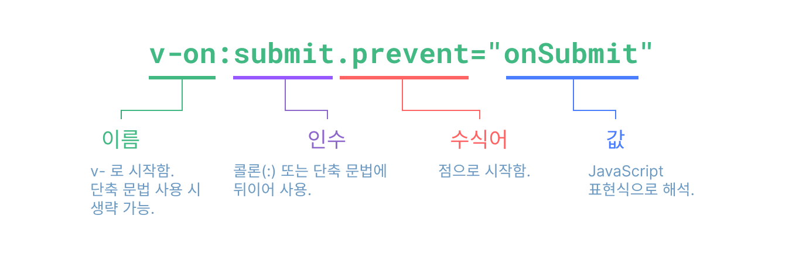

# 템플릿 문법

Vue는 HTML 기반의 템플릿 문법을 사용하여 DOM을 데이터에 선언적으로 바인딩합니다.

템플릿을 최적화된 JavaScript 코드로 컴파일하며, 반응성 시스템과 결합하고 상태 변경 시 최소한의 DOM 조작만 수행합니다.

---

## 기본 데이터 바인딩

### 텍스트 보간 (Text Interpolation)

이중 중괄호를 사용하여 데이터를 텍스트로 표시하며, 데이터가 변경되면 자동으로 업데이트됩니다.

```vue
<script setup>
import { ref } from 'vue'

const msg = ref('안녕하세요 Vue!')
const count = ref(0)
</script>

<template>
  <p>메시지: {{ msg }}</p>
  <p>카운트: {{ count }}</p>
</template>
```

### JavaScript 표현식 및 함수 사용

템플릿에서 JavaScript 표현식과 함수를 호출하여 사용할 수 있습니다.

```vue
<script setup>
import { ref } from 'vue'

const ok = ref(true)
const id = ref(123)

const formatDate = (date) => {
  return new Date(date).toLocaleDateString()
}

const toTitleDate = (date) => {
  return new Date(date).toISOString()
}

const date = ref('2024-01-15')
</script>

<template>
  <!-- 삼항 연산자 -->
  <p>{{ ok ? 'YES' : 'NO' }}</p>  <!-- YES -->
  
  <!-- 템플릿 리터럴 -->
  <div :id="`list-${id}`"></div>  <!-- id="list-123" -->

  <!-- 함수 호출 -->
  <time :title="toTitleDate(date)" :datetime="date">
    {{ formatDate(date) }}
  </time>
</template>
```

---

## 디렉티브 (Directives)

디렉티브는 `v-` 접두사가 붙은 특수 속성입니다.

### 디렉티브 구조



#### 1. 인자

일부 디렉티브는 콜론(`:`)으로 표시되는 인자를 받을 수 있습니다.

```vue
<a v-bind:href="url"> ... </a>
```

#### 2. 동적 인자

디렉티브 인자에 대괄호 `[]`로 감싼 JavaScript 표현식을 사용할 수도 있습니다.

```vue
<a v-bind:[attributeName]="url"> ... </a>

<!-- 축약 문법 -->
<a :[attributeName]="url"> ... </a>
```

#### 3. 수식어

수식어는 점(`.`)으로 표시되는 특수 접미사로, 디렉티브가 특별한 방식으로 바인딩되어야 함을 나타냅니다.

예를 들어, `.prevent` 수식어는 `v-on` 디렉티브에 트리거된 이벤트에서 `event.preventDefault()`를 호출하라고 지시합니다.

```vue
<form @submit.prevent="onSubmit">...</form>
```

---

## `v-bind` - 속성 바인딩

### 기본 사용법

HTML 속성에 데이터를 바인딩할 때는 `v-bind` 디렉티브를 사용합니다.

```vue
<script setup>
import { ref } from 'vue'

const dynamicId = ref('my-id')
const imageUrl = ref('/logo.png')
const isDisabled = ref(true)
</script>

<template>
  <!-- 전체 문법 -->
  <div v-bind:id="dynamicId">내용</div>
  
  <!-- 축약 문법 (권장) -->
  <div :id="dynamicId">내용</div>
  
  <button :disabled="isDisabled">버튼</button>
</template>
```

---

## `v-if` - 조건부 렌더링

조건에 따라 요소를 **DOM에서 추가/제거**할 수 있습니다.

### 사용 가능한 디렉티브
- `v-if`
- `v-else-if`
- `v-else`

### 기본 사용법

```vue
<script setup>
import { ref } from 'vue'

const score = ref(85)
</script>

<template>
  <p v-if="score >= 90">A등급</p>
  <p v-else-if="score >= 80">B등급</p>
  <p v-else-if="score >= 70">C등급</p>
  <p v-else>F등급</p>
</template>
```

---

## `v-show` - 조건부 표시

조건에 따라 요소를 **CSS display로 숨김/표시**할 수 있습니다.

```vue
<script setup>
import { ref } from 'vue'

const isVisible = ref(false)
</script>

<template>
  <p v-show="isVisible">이 텍스트는 숨겨져 있습니다</p>
  <!-- 렌더링 결과: <p style="display: none;">이 텍스트는 숨겨져 있습니다</p> -->
</template>
```

---

### `v-if` vs `v-show` 비교

| 특징 | `v-if` | `v-show` |
|------|--------|----------|
| **DOM 렌더링** | 조건이 false면 DOM에서 제거 | 항상 DOM에 존재 |
| **CSS 처리** | - | `display: none` 사용 |
| **초기 렌더링 비용** | 낮음 (false면 렌더링 안함) | 높음 (항상 렌더링) |
| **토글 비용** | 높음 (DOM 추가/제거) | 낮음 (CSS만 변경) |
| **사용 권장** | 조건이 자주 변하지 않을 때 | 자주 토글할 때 |

#### 실제 렌더링 차이

```vue
<script setup>
import { ref } from 'vue'

const show = ref(false)
</script>

<template>
  <!-- v-if: DOM에 존재하지 않음 -->
  <p v-if="show">v-if 텍스트</p>
  <!-- 렌더링 결과: (아무것도 없음) -->
  
  <!-- v-show: DOM에 존재하지만 숨겨짐 -->
  <p v-show="show">v-show 텍스트</p>
  <!-- 렌더링 결과: <p style="display: none;">v-show 텍스트</p> -->
</template>
```

---

## `v-for` - 리스트 렌더링

배열이나 객체를 반복하여 렌더링할 수 있습니다.

### 기본 사용법

```vue
<script setup>
import { ref } from 'vue'

const items = ref([
  { id: 1, text: '배우기' },
  { id: 2, text: '연습하기' },
  { id: 3, text: '만들기' }
])
</script>

<template>
  <ul>
    <li v-for="(item, index) in items" :key="item.id">
      {{ index }}. {{ item.text }}
    </li>
  </ul>
</template>
```

### `key`의 중요성

**반드시 고유한 key를 제공**해야 Vue가 효율적으로 DOM을 업데이트할 수 있습니다.

```vue
<template>
  <!-- ✅ 좋은 예: 고유한 ID 사용 -->
  <div v-for="item in items" :key="item.id">
    {{ item.name }}
  </div>
  
  <!-- ⚠️ 피해야 할 예: 인덱스 사용 (재정렬 시 문제 발생 가능) -->
  <div v-for="(item, index) in items" :key="index">
    {{ item.name }}
  </div>
  
  <!-- ❌ 나쁜 예: key 없음 (경고 발생) -->
  <div v-for="item in items">
    {{ item.name }}
  </div>
</template>
```

---

## `v-on` - 이벤트 처리

DOM 이벤트를 감지하고 JavaScript를 실행할 수 있습니다.

### 기본 사용법

```vue
<script setup>
import { ref } from 'vue'

const count = ref(0)

function increment() {
  count.value++
}
</script>

<template>
  <!-- 전체 문법 -->
  <button v-on:click="increment">클릭</button>
  
  <!-- 축약 문법 (권장) -->
  <button @click="increment">+1</button>
  
  <p>카운트: {{ count }}</p>
</template>
```

---

### 이벤트 객체 접근

```vue
<script setup>
function handleClick(event) {
  console.log(event.target.tagName)
}

function handleWithParam(message, event) {
  console.log(message)
  console.log(event.target)
}
</script>

<template>
  <!-- 자동으로 이벤트 객체 전달 -->
  <button @click="handleClick">클릭</button>
  
  <!-- $event로 명시적 전달 -->
  <button @click="handleWithParam('안녕', $event)">클릭</button>
</template>
```

---

## `v-model` - 양방향 바인딩

폼 입력 요소와 데이터를 양방향으로 바인딩할 수 있습니다.

### 기본 사용법

```vue
<script setup>
import { ref } from 'vue'

const text = ref('')
const message = ref('안녕하세요')
</script>

<template>
  <input v-model="text" placeholder="입력하세요">
  <p>입력값: {{ text }}</p>
  
  <textarea v-model="message"></textarea>
  <p>{{ message }}</p>
</template>
```

### `v-model`의 동작 원리

`v-model`은 `v-bind`와 `v-on`의 조합입니다.

```vue
<template>
  <!-- v-model 사용 -->
  <input v-model="text">
  
  <!-- 위와 동일 (내부 동작) -->
  <input
    :value="text"
    @input="text = $event.target.value"
  >
</template>
```

---

## Vue 렌더링 메커니즘

템플릿이 화면에 그려지는 과정을 확인해보겠습니다.

### 1단계: 템플릿 → JavaScript 함수

Vue 템플릿은 실행 시, JavaScript 함수로 변환됩니다.

#### Vue 템플릿 코드

```vue
<template>
  <div id="app">
    <h1>{{ title }}</h1>
    <p>{{ message }}</p>
  </div>
</template>
```

#### 컴파일 후 생성되는 JavaScript 코드

```js
function render() {
  return createElementVNode("div", { id: "app" }, [
    createElementVNode("h1", null, title),
    createElementVNode("p", null, message)
  ])
}
```

이 render 함수가 실행될 때마다 JavaScript 객체를 반환하는데,<br>
이 객체를 **가상 DOM**(Virtual DOM)이라고 합니다.

### 2단계: JavaScript 객체 (가상 DOM)

렌더 함수가 반환하는 JavaScript 객체는 다음과 같은 구조로 이루어집니다.

이 객체는 생성과 비교가 빠르며, 실제 DOM 조작 없이 메모리에서만 처리합니다.

```js
// 실제 반환되는 객체 구조
{
  type: "div",
  props: { id: "app" },
  children: [
    {
      type: "h1",
      children: "안녕하세요"
    },
    {
      type: "p",
      children: "Vue 렌더링입니다"
    }
  ]
}
```

### 3단계: 실제 DOM 생성

가상 DOM 객체를 보고 실제 HTML 요소를 만듭니다.

```js
// 가상 DOM 객체 → 실제 DOM 요소
const div = document.createElement('div')
div.id = 'app'

const h1 = document.createElement('h1')
h1.textContent = '안녕하세요'

const p = document.createElement('p')
p.textContent = 'Vue 렌더링입니다'

div.appendChild(h1)
div.appendChild(p)
```

#### 최종 결과

```html
<div id="app">
  <h1>안녕하세요</h1>
  <p>Vue 렌더링입니다</p>
</div>
```

### 데이터 변경 시 업데이트 과정

```vue
<script setup>
import { ref } from 'vue'

const count = ref(0)

function increment() {
  count.value++  // 0 → 1로 변경
}
</script>

<template>
  <div>
    <h1>카운터</h1>
    <p>{{ count }}</p>
    <button @click="increment">증가</button>
  </div>
</template>
```

#### `count`가 변경될 때 발생하는 과정

**1. 렌더 함수 재실행**

```js
// 새로운 가상 DOM 생성
{
  type: "div",
  children: [
    { type: "h1", children: "카운터" },
    { type: "p", children: "1" },  // 0 → 1 변경
    { type: "button", children: "증가" }
  ]
}
```

**2. 이전 가상 DOM과 비교**

```js
// 이전
{ type: "p", children: "0" }

// 새로운
{ type: "p", children: "1" }

// 차이점: children이 "0"에서 "1"로 변경됨
```

**3. 필요한 부분만 실제 DOM 업데이트**

```js
// Vue가 실행하는 코드
pElement.textContent = "1"
```

전체 DOM을 다시 그리지 않고, **변경된 텍스트만 교체**합니다.

---

## Vue의 최적화 기법

### 1. 정적 콘텐츠는 한 번만 생성

```vue
<template>
  <div>
    <h1>고정된 제목</h1>
    <nav>
      <a href="/">홈</a>
      <a href="/about">소개</a>
    </nav>
    <p>{{ dynamicText }}</p>
  </div>
</template>
```

#### 컴파일 시 최적화

```js
// 정적 부분은 상수로 추출
const _hoisted_1 = createElementVNode("h1", null, "고정된 제목")
const _hoisted_2 = createElementVNode("nav", null, [
  createElementVNode("a", { href: "/" }, "홈"),
  createElementVNode("a", { href: "/about" }, "소개")
])

function render() {
  return createElementVNode("div", null, [
    _hoisted_1,  // 재사용
    _hoisted_2,  // 재사용
    createElementVNode("p", null, dynamicText)  // 매번 생성
  ])
}
```

`_hoisted_1`과 `_hoisted_2`는 **한 번만 생성**되고 계속 재사용됩니다.

### 2. 동적 부분 표시 (Patch Flags)

Vue는 컴파일 시 어떤 부분이 동적인지 표시합니다.

```vue
<template>
  <div :class="{ active }">{{ text }}</div>
</template>
```

#### 컴파일 결과

```js
function render() {
  return createElementVNode("div", {
    class: normalizeClass({ active })
  }, text, 3)  // ← 숫자 3은 "class와 text가 동적"이라는 표시
}
```

이 숫자는 **패치 플래그**(Patch Flag)로, 업데이트 시 Vue가 확인해야 할 항목을 알려줍니다.

### 3. 동적 노드만 추적

```vue
<template>
  <div>
    <header>
      <h1>제목</h1>
      <nav>메뉴</nav>
    </header>
    <main>
      <p>{{ content }}</p>
    </main>
    <footer>
      <p>저작권</p>
    </footer>
  </div>
</template>
```

Vue는 컴파일 시 동적 노드만 배열로 추적합니다:

```js
const dynamicNodes = [
  pElement  // {{ content }}가 있는 <p> 요소만
]
```

#### 업데이트 시

- 전체 DOM 트리를 순회하지 않음
- `dynamicNodes` 배열의 요소만 확인

---

## 실제 컴파일 결과 확인하기

[Vue 공식 템플릿 탐색기](https://play.vuejs.org/)에서 직접 확인할 수 있습니다.

### 예제 코드

```vue
<template>
  <div>
    <h1>{{ title }}</h1>
    <button @click="count++">{{ count }}</button>
  </div>
</template>
```

### 실제 컴파일 결과

```js
import { 
  createElementVNode as _createElementVNode, 
  toDisplayString as _toDisplayString, 
  openBlock as _openBlock, 
  createElementBlock as _createElementBlock 
} from "vue"

export function render(_ctx, _cache, $props, $setup, $data, $options) {
  return (_openBlock(), _createElementBlock("div", null, [
    _createElementVNode("h1", null, _toDisplayString(_ctx.title), 1 /* TEXT */),
    _createElementVNode("button", {
      onClick: _cache[0] || (_cache[0] = $event => (_ctx.count++))
    }, _toDisplayString(_ctx.count), 9 /* TEXT, PROPS */)
  ]))
}
```