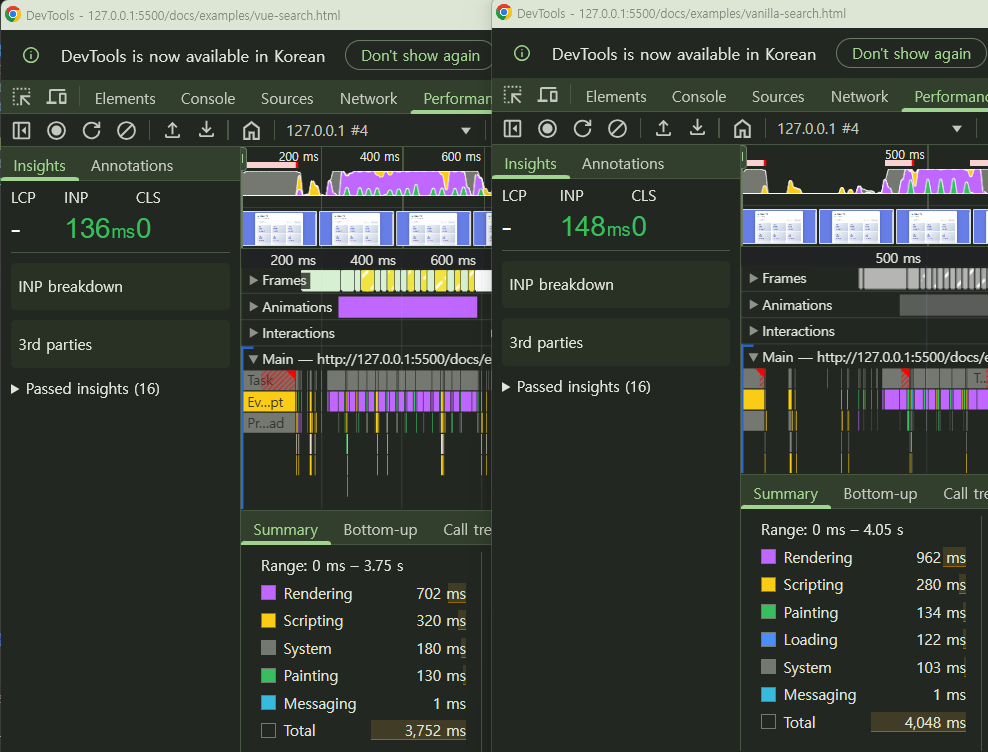

# Vanilla JS와 비교

**검색 기능을 동일하게 구현한 화면:**

- [vanilla JS 화면](examples/vanilla-search.html)

- [Vue.js 화면](examples/vue-search.html)

## 코드 비교

### 1️⃣ 상태 관리 (State Management)

**순수 JavaScript:**
```javascript
// 전역 변수로 상태 관리
let currentSearchText = '';
let currentCategory = 'all';

// 상태 변경 시 수동으로 UI 업데이트 필요
searchInput.addEventListener('input', function(e) {
    currentSearchText = e.target.value;
    renderProducts();
});
```

**Vue 3:**
```javascript
// 반응형 상태
const searchText = ref('');
const selectedCategory = ref('all');

// 자동 업데이트
<input v-model="searchText">
```
- 상태가 변경되면 자동으로 UI 업데이트
- 이벤트 리스너 수동 등록 불필요
- v-model로 양방향 바인딩 한 줄로 해결

---

### 2️⃣ 데이터 필터링

**순수 JavaScript:**
```javascript
// 필터링 함수 정의
function filterProducts() {
    let filtered = products.filter(product => {
        const matchesSearch = product.name.toLowerCase()
            .includes(currentSearchText.toLowerCase());
        const matchesCategory = currentCategory === 'all' || 
            product.category === currentCategory;
        return matchesSearch && matchesCategory;
    });
    return filtered;
}

// 수동으로 호출
const filtered = filterProducts();
```

**Vue 3:**
```javascript
// Computed 속성 - 의존성 자동 추적
const filteredProducts = computed(() => {
    return products.value.filter(product => {
        const matchesSearch = product.name.toLowerCase()
            .includes(searchText.value.toLowerCase());
        const matchesCategory = selectedCategory.value === 'all' || 
            product.category === selectedCategory.value;
        return matchesSearch && matchesCategory;
    });
});

// 자동으로 재계산! (수동 호출 불필요)
```
- computed는 의존성을 자동으로 추적하여 의존성 데이터가 변경되면 자동 재계산
- 결과가 캐싱되어 불필요한 재계산 방지

---

### 3️⃣ UI 렌더링

**순수 JavaScript:**
```javascript
function renderProducts() {
    const filtered = filterProducts();
    
    // 1. 결과 카운트 수동 업데이트
    resultCount.textContent = `${filtered.length}개 제품`;
    
    // 2. 기존 DOM 완전히 비우기
    productGrid.innerHTML = '';
    
    // 3. 조건부 렌더링 수동 처리
    if (filtered.length === 0) {
        productGrid.style.display = 'none';
        noResults.style.display = 'block';
    } else {
        productGrid.style.display = 'grid';
        noResults.style.display = 'none';
        
        // 4. DOM 요소 하나하나 생성 및 추가
        filtered.forEach(product => {
            const card = document.createElement('div');
            card.className = 'product-card';
            card.innerHTML = `
                <div class="product-name">${product.name}</div>
                <span class="product-category">${product.category}</span>
                <div class="product-price">${product.price.toLocaleString()}원</div>
            `;
            productGrid.appendChild(card);
        });
    }
}
```

**Vue 3:**
```html
<!-- 결과 카운트 - 자동 업데이트 -->
<div class="result-count">
    {{ filteredProducts.length }}개 제품
</div>

<!-- 조건부 렌더링 - v-if -->
<div v-if="filteredProducts.length === 0" class="no-results">
    <div class="no-results-icon">😕</div>
    <div>검색 결과가 없습니다</div>
</div>

<!-- 리스트 렌더링 - v-for (자동으로 최적화) -->
<div v-for="product in filteredProducts" :key="product.id" class="product-card">
    <div class="product-name">{{ product.name }}</div>
    <span class="product-category">{{ product.category }}</span>
    <div class="product-price">{{ formatPrice(product.price) }}원</div>
</div>
```
- 선언적 프로그래밍 (무엇을 보여줄지만 정의)
- DOM 조작 코드 완전히 제거
- v-for가 자동으로 Virtual DOM 최적화
- 코드량 약 80% 감소

### 퍼포먼스 비교
간단히 검색 동작을 두 화면에서 비교하여 퍼포먼스를 측정해보았습니다.<br>
10000개 이상 데이터로 검색 동작을 하였을 때, vue가 성능이 바닐라JS보다 더 좋은 것을 확인해볼 수 있었습니다.
